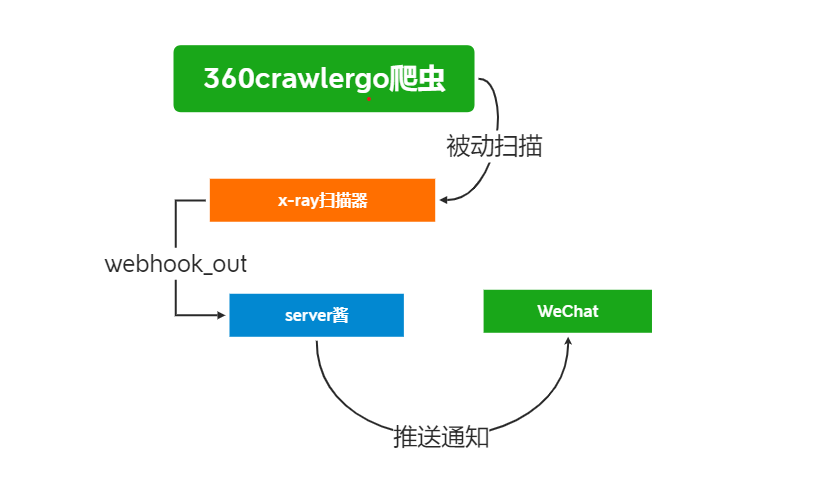
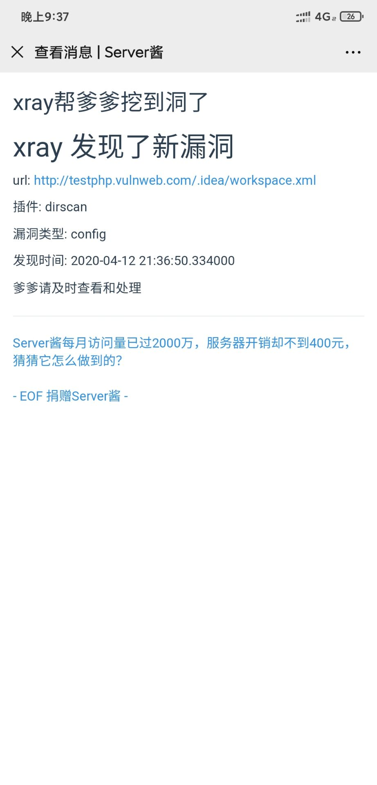

# **Xray_and_crwlergo_in_server**

 

### **简介**

xray与crwlergo联动

https://github.com/0Kee-Team/crawlergo

https://github.com/chaitin/xray

https://github.com/timwhitez/crawlergo_x_XRAY

server酱推送

http://sc.ftqq.com/




雇一位免费的360工程师和一位长亭工程师为你挖洞，还有听话的server酱给你汇报


### **使用**

crawlergo 只依赖chromium运行即可，前往[下载](https://www.chromium.org/getting-involved/download-chromium)新版本的chromium，或者直接[点击下载Linux79版本](https://storage.googleapis.com/chromium-browser-snapshots/Linux_x64/706915/chrome-linux.zip)。
前往[页面下载](https://github.com/0Kee-Team/crawlergo/releases)最新版本的crawlergo解压到任意目录，默认放在root目录。可更改launcher.py中的文件位置


 chrome运行提示缺少 xxx.so 等依赖

  ```shell
  // Ubuntu
  apt-get install -yq --no-install-recommends \
       libasound2 libatk1.0-0 libc6 libcairo2 libcups2 libdbus-1-3 \
       libexpat1 libfontconfig1 libgcc1 libgconf-2-4 libgdk-pixbuf2.0-0 libglib2.0-0 libgtk-3-0 libnspr4 \
       libpango-1.0-0 libpangocairo-1.0-0 libstdc++6 libx11-6 libx11-xcb1 libxcb1 \
       libxcursor1 libxdamage1 libxext6 libxfixes3 libxi6 libxrandr2 libxrender1 libxss1 libxtst6 libnss3
       
  // CentOS 7
  sudo yum install pango.x86_64 libXcomposite.x86_64 libXcursor.x86_64 libXdamage.x86_64 libXext.x86_64 libXi.x86_64 \
       libXtst.x86_64 cups-libs.x86_64 libXScrnSaver.x86_64 libXrandr.x86_64 GConf2.x86_64 alsa-lib.x86_64 atk.x86_64 gtk3.x86_64 \
       ipa-gothic-fonts xorg-x11-fonts-100dpi xorg-x11-fonts-75dpi xorg-x11-utils xorg-x11-fonts-cyrillic xorg-x11-fonts-Type1 xorg-x11-fonts-misc -y
  
  sudo yum update nss -y
  ```


git clone 项目 将xray和crwlergo文件放到根目录

编辑serverjiang.py添加server酱的api

添加需要扫描的url到targets.txt

执行sh start.sh

 所有日志均在logs文件夹中，可分类查看！




